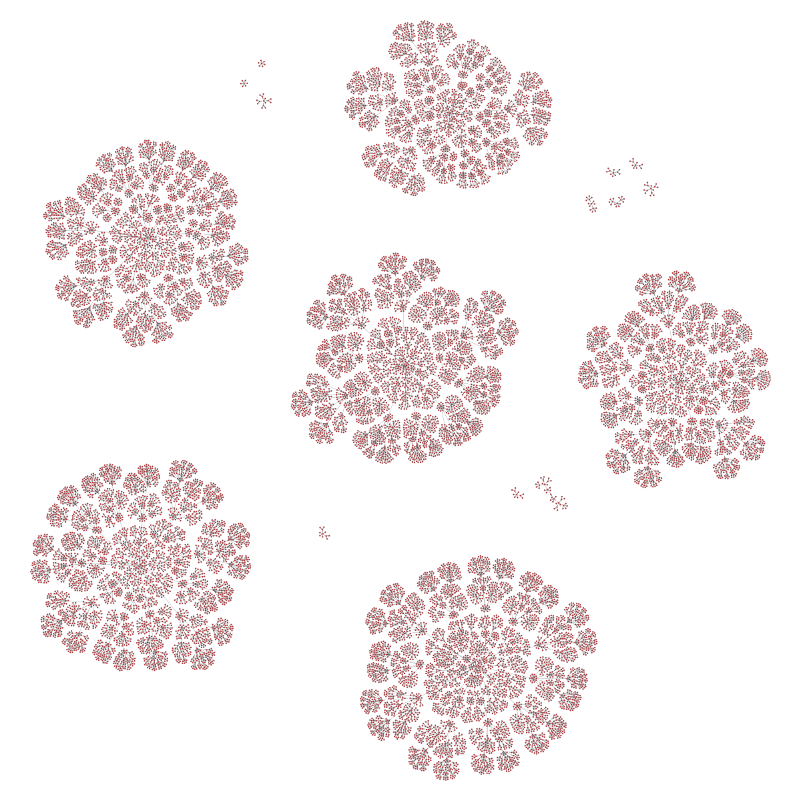

# syntactic-span
repository for implementations of the [syntactic span](https://en.wikipedia.org/wiki/Deductive_closure) operation over some (initially toy) formal languages

A theory graph for a :

